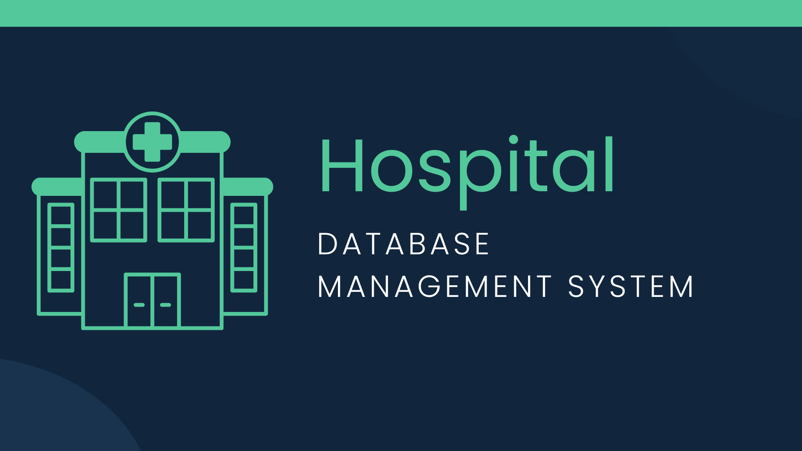

## About

The HospitalDatabase application was released in 2024. Its purpose is to assist healthcare professionals, particularly those involved in hospital data management. Our goal is to enhance their efficiency by improving healthcare data management. HospitalDatabase simplifies the recapitulation of medical records and hospital administration processes. HospitalDatabase offers four excellent features including:

1. **Read Hospital Patient**, HospitalDatabase displays the entire patient data available in the database, and you will always receive the latest updates from your database.
2. **Add Hospital Patient**, HospitalDatabase helps you register new patient records, such as their information or medical history.
3. **Change Hospital Patient**, HospitalDatabase helps you update existing patient records, such as their information or medical history.
4. **Delete Hospital Patient**, HospitalDatabase helps you delete patient records as needed.

## Installation

To get this project, you can clone it by running the following code:

    git clone git@github.com:hamzahmulyana/Capstone-Project-1.git

    
## Project Organization

The directory structure of FruitMarket project looks like this:

    ├── README.md          <- The top-level README for developers using this project.
    │
    ├── data               <- Hospital Patient database
    │
    ├── docs               <- The document will consist of a detailed presentation or images.
    │
    ├── src                <- Source code for use in this project.
    │
    └── requirements.txt   <- The requirements file for reproducing the analysis environment, e.g.
                             generated with `pip freeze > requirements.txt`

## Contribute

If you'd like to contribute, feel free to contact me here:

  
